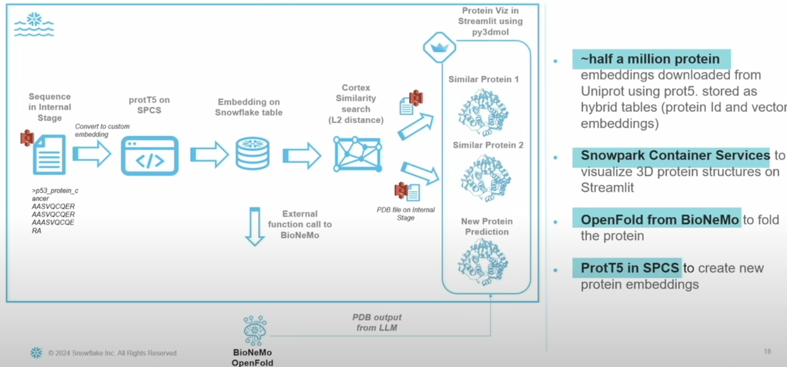
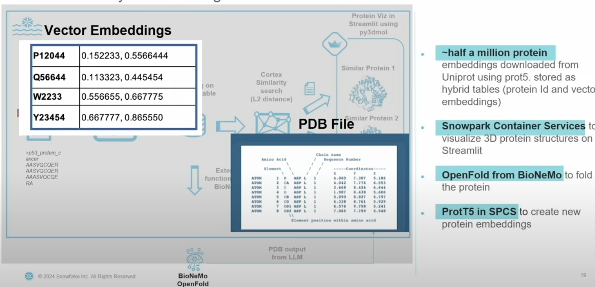
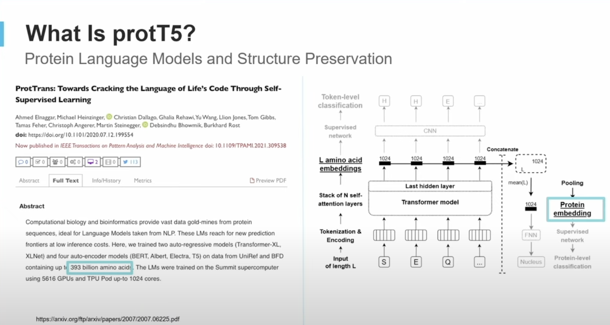
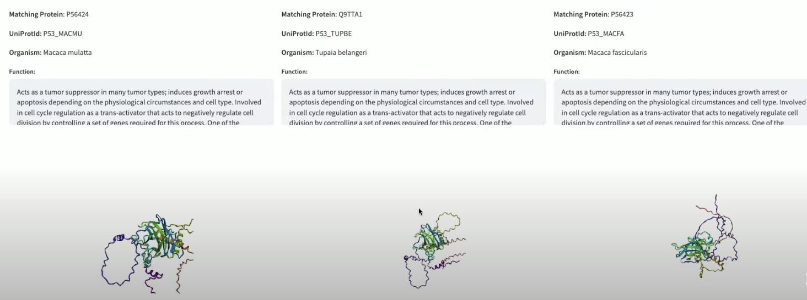

## The Outcome: Protein Similarity Search

Similarity search was able to extract the structurally/functionally similar proteins.

| Features  | Input Protein  | Similar Protein 1 from Cortex AI | Similar Protein 2 from Cortex AI |
|-----------|----------------|----------------------------------|----------------------------------|
| **ID**    | LICHRVHGLQTCEPDQKFCFRKTTMFFPNHPVLL MGTSSCPTEKYSVCCSTDKCNK | P0DQH2 | P0DKS3 |
| **Name**  | Neurotoxin Oh9-1 | Exactin | Mambalgin-2 |
| **Organism** | King Cobra | Sepedon haemachatus | Black Mamba |
| **Function** | This toxin binds and inhibits rat muscle Toxin activity | Anticoagulant protein that prevents the activation of factor X (F10). It acts by potently inhibiting the extrinsic tenase complex. | This three-finger toxin inhibits ASIC channels. It acts as a gating modifier toxin by decreasing the apparent proton sensitivity of activation and by slightly increasing the apparent proton sensitivity for inactivation. |

## Additional Matching Proteins

| Matching Protein | UniProtID  | Organism            | Function |
|------------------|------------|---------------------|----------|
| P56424           | P53_MACMU  | Macaca mulatta      | Acts as a tumor suppressor in many tumor types; induces growth arrest or apoptosis depending on the physiological circumstances and cell type. Involved in cell cycle regulation as a trans-activator that acts to negatively regulate cell division by controlling a set of genes required for this process. |
| Q9TTA1           | P53_TUPBE  | Tupaia belangeri    | Acts as a tumor suppressor in many tumor types; induces growth arrest or apoptosis depending on the physiological circumstances and cell type. Involved in cell cycle regulation as a trans-activator that acts to negatively regulate cell division by controlling a set of genes required for this process. |
| P56423           | P53_MACFA  | Macaca fascicularis | Acts as a tumor suppressor in many tumor types; induces growth arrest or apoptosis depending on the physiological circumstances and cell type. Involved in cell cycle regulation as a trans-activator that acts to negatively regulate cell division by controlling a set of genes required for this process. |
